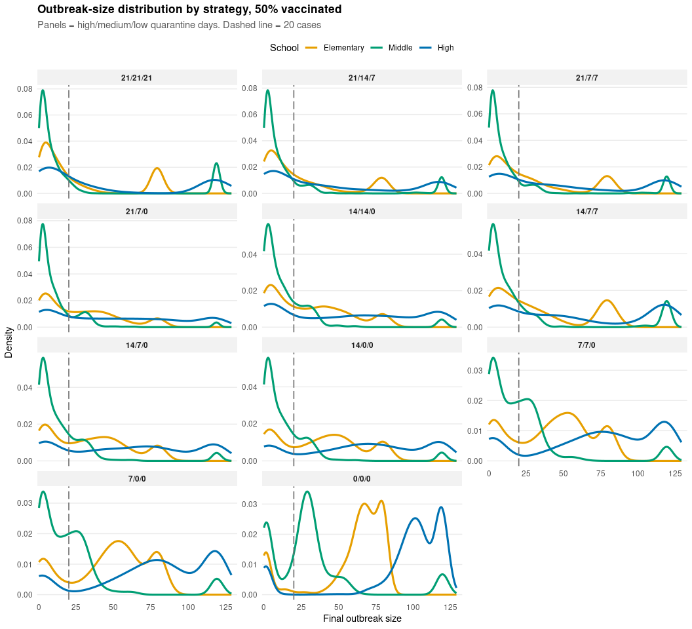
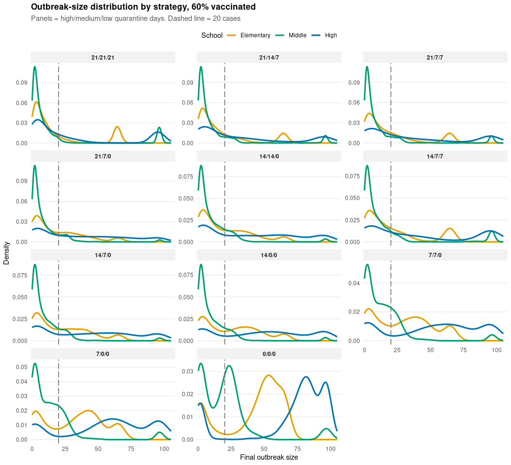
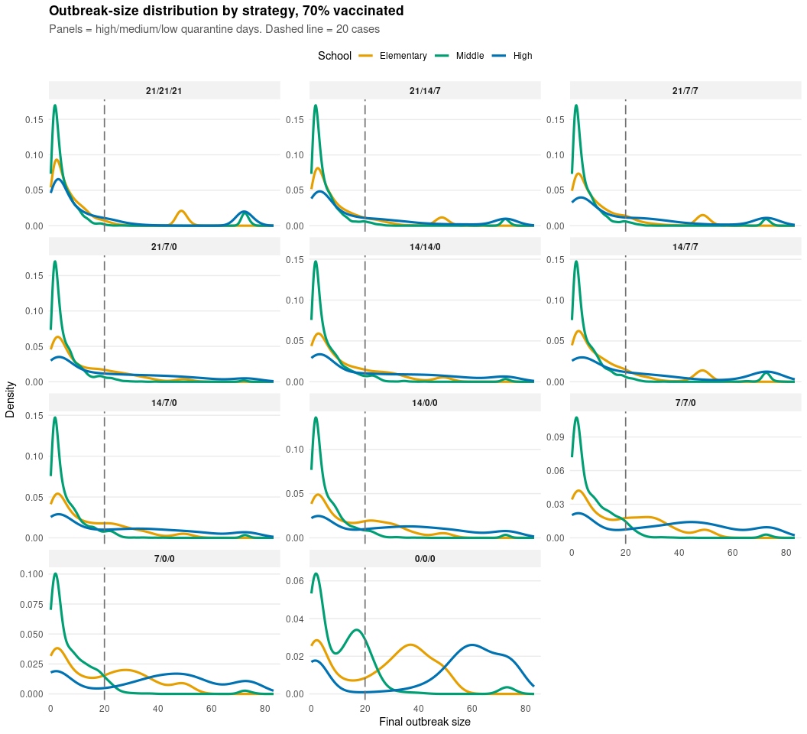
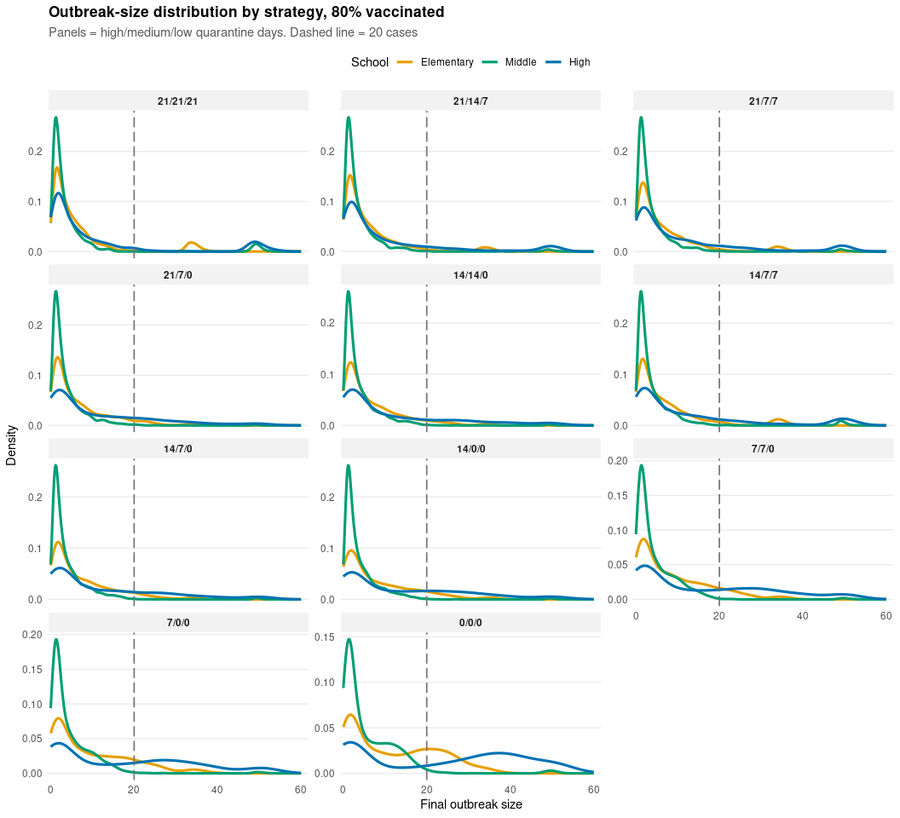
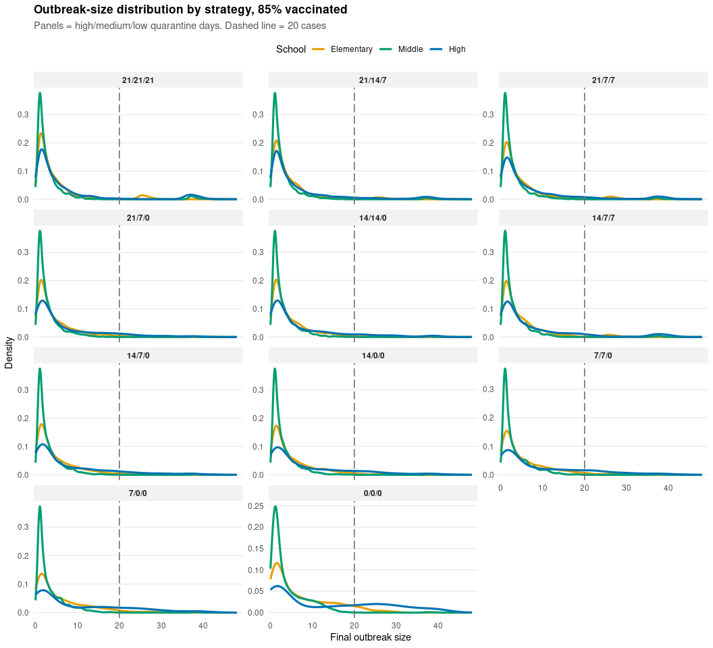

# 2. Outbreak-size distributions by quarantine strategy

- [Density curves, all schools](#density-curves-all-schools)
- [Histograms by school](#histograms-by-school)

How big do outbreaks get under each quarantine strategy? For every
school, vaccination level and one of 11 strategies (**high / medium /
low-risk quarantine days**), we look at the full distribution of final
outbreak sizes rather than a single probability.

- **Density curves** overlay the three schools, one panel per strategy.
- **Histograms** show the raw counts for one school at a time.
- **Tables** give the median, 95th percentile and P(size ≥ K).

> **Note**
>
> Model code lives in `measles_model.R`. Simulations are cached in
> `results/`, and PNG copies of every figure are saved to `figures/`.

## Density curves, all schools

### 50% vaccinated

| Strategy (H/M/L) | Elementary median | Elementary 95th pct | Elementary P(≥20) | Middle median | Middle 95th pct | Middle P(≥20) | High median | High 95th pct | High P(≥20) |
|:-----------------|------------------:|--------------------:|------------------:|--------------:|----------------:|--------------:|------------:|--------------:|------------:|
| 21/21/21         |                11 |                  80 |             0.334 |             6 |             119 |         0.187 |          15 |           119 |       0.454 |
| 21/14/7          |                13 |                  79 |             0.400 |             6 |             119 |         0.188 |          26 |           119 |       0.545 |
| 21/7/7           |                16 |                  80 |             0.448 |             6 |             119 |         0.186 |          34 |           119 |       0.601 |
| 21/7/0           |                22 |                  79 |             0.527 |             6 |              35 |         0.194 |          46 |           118 |       0.675 |
| 14/14/0          |                25 |                  80 |             0.548 |             8 |              38 |         0.255 |          55 |           119 |       0.672 |
| 14/7/7           |                22 |                  80 |             0.528 |             8 |             119 |         0.261 |          46 |           119 |       0.681 |
| 14/7/0           |                32 |                  80 |             0.625 |             8 |              41 |         0.256 |          61 |           119 |       0.738 |
| 14/0/0           |                39 |                  80 |             0.679 |             8 |              40 |         0.257 |          69 |           119 |       0.804 |
| 7/7/0            |                46 |                  80 |             0.735 |            15 |              63 |         0.415 |          78 |           120 |       0.826 |
| 7/0/0            |                51 |                  81 |             0.782 |            15 |             118 |         0.423 |          82 |           120 |       0.865 |
| 0/0/0            |                67 |                  81 |             0.862 |            28 |             119 |         0.700 |         103 |           121 |       0.905 |

### 60% vaccinated

| Strategy (H/M/L) | Elementary median | Elementary 95th pct | Elementary P(≥20) | Middle median | Middle 95th pct | Middle P(≥20) | High median | High 95th pct | High P(≥20) |
|:-----------------|------------------:|--------------------:|------------------:|--------------:|----------------:|--------------:|------------:|--------------:|------------:|
| 21/21/21         |                 8 |                  65 |             0.244 |             4 |              96 |         0.124 |          11 |            96 |       0.374 |
| 21/14/7          |                 9 |                  65 |             0.281 |             4 |              74 |         0.134 |          16 |            96 |       0.464 |
| 21/7/7           |                10 |                  65 |             0.320 |             4 |              49 |         0.136 |          19 |            96 |       0.498 |
| 21/7/0           |                12 |                  64 |             0.398 |             4 |              27 |         0.128 |          28 |            95 |       0.578 |
| 14/14/0          |                13 |                  64 |             0.414 |             5 |              29 |         0.160 |          33 |            96 |       0.590 |
| 14/7/7           |                13 |                  65 |             0.375 |             5 |              96 |         0.163 |          25 |            97 |       0.566 |
| 14/7/0           |                17 |                  64 |             0.476 |             5 |              29 |         0.160 |          40 |            96 |       0.645 |
| 14/0/0           |                24 |                  65 |             0.542 |             5 |              28 |         0.160 |          49 |            97 |       0.717 |
| 7/7/0            |                29 |                  65 |             0.606 |            10 |              35 |         0.252 |          56 |            97 |       0.747 |
| 7/0/0            |                35 |                  66 |             0.680 |            10 |              39 |         0.256 |          61 |            97 |       0.797 |
| 0/0/0            |                50 |                  66 |             0.780 |            19 |              53 |         0.482 |          81 |            98 |       0.845 |

### 70% vaccinated

| Strategy (H/M/L) | Elementary median | Elementary 95th pct | Elementary P(≥20) | Middle median | Middle 95th pct | Middle P(≥20) | High median | High 95th pct | High P(≥20) |
|:-----------------|------------------:|--------------------:|------------------:|--------------:|----------------:|--------------:|------------:|--------------:|------------:|
| 21/21/21         |                 5 |                  49 |             0.136 |             3 |              72 |         0.066 |           6 |            73 |       0.245 |
| 21/14/7          |                 6 |                  48 |             0.166 |             3 |              21 |         0.060 |           8 |            72 |       0.318 |
| 21/7/7           |                 6 |                  49 |             0.192 |             3 |              21 |         0.060 |          10 |            73 |       0.371 |
| 21/7/0           |                 7 |                  36 |             0.236 |             3 |              18 |         0.040 |          13 |            71 |       0.422 |
| 14/14/0          |                 8 |                  40 |             0.242 |             3 |              21 |         0.062 |          14 |            72 |       0.442 |
| 14/7/7           |                 8 |                  49 |             0.208 |             3 |              24 |         0.070 |          14 |            74 |       0.432 |
| 14/7/0           |                 9 |                  41 |             0.299 |             3 |              21 |         0.062 |          21 |            72 |       0.508 |
| 14/0/0           |                11 |                  42 |             0.360 |             3 |              21 |         0.062 |          27 |            73 |       0.585 |
| 7/7/0            |                14 |                  48 |             0.409 |             4 |              21 |         0.076 |          34 |            74 |       0.635 |
| 7/0/0            |                17 |                  49 |             0.470 |             4 |              22 |         0.075 |          40 |            74 |       0.697 |
| 0/0/0            |                30 |                  50 |             0.624 |             9 |              26 |         0.175 |          58 |            76 |       0.778 |

### 80% vaccinated

| Strategy (H/M/L) | Elementary median | Elementary 95th pct | Elementary P(≥20) | Middle median | Middle 95th pct | Middle P(≥20) | High median | High 95th pct | High P(≥20) |
|:-----------------|------------------:|--------------------:|------------------:|--------------:|----------------:|--------------:|------------:|--------------:|------------:|
| 21/21/21         |                 4 |                  33 |             0.072 |             2 |              14 |         0.043 |           4 |            49 |       0.137 |
| 21/14/7          |                 4 |                  21 |             0.054 |             2 |              12 |         0.016 |           5 |            49 |       0.166 |
| 21/7/7           |                 4 |                  22 |             0.059 |             2 |              12 |         0.016 |           5 |            49 |       0.184 |
| 21/7/0           |                 4 |                  21 |             0.066 |             2 |              12 |         0.007 |           6 |            39 |       0.229 |
| 14/14/0          |                 4 |                  22 |             0.070 |             2 |              13 |         0.009 |           5 |            42 |       0.236 |
| 14/7/7           |                 4 |                  33 |             0.082 |             2 |              13 |         0.026 |           6 |            50 |       0.216 |
| 14/7/0           |                 4 |                  22 |             0.084 |             2 |              13 |         0.010 |           7 |            43 |       0.266 |
| 14/0/0           |                 5 |                  25 |             0.113 |             2 |              13 |         0.009 |           9 |            46 |       0.342 |
| 7/7/0            |                 6 |                  25 |             0.130 |             2 |              14 |         0.009 |          10 |            49 |       0.388 |
| 7/0/0            |                 6 |                  27 |             0.167 |             2 |              14 |         0.011 |          15 |            50 |       0.444 |
| 0/0/0            |                10 |                  30 |             0.278 |             3 |              16 |         0.024 |          27 |            51 |       0.575 |

### 85% vaccinated

| Strategy (H/M/L) | Elementary median | Elementary 95th pct | Elementary P(≥20) | Middle median | Middle 95th pct | Middle P(≥20) | High median | High 95th pct | High P(≥20) |
|:-----------------|------------------:|--------------------:|------------------:|--------------:|----------------:|--------------:|------------:|--------------:|------------:|
| 21/21/21         |                 3 |                  17 |             0.048 |             2 |               9 |         0.028 |           3 |            37 |       0.080 |
| 21/14/7          |                 3 |                  14 |             0.033 |             2 |               9 |         0.014 |           3 |            31 |       0.087 |
| 21/7/7           |                 3 |                  16 |             0.038 |             2 |               9 |         0.014 |           3 |            34 |       0.093 |
| 21/7/0           |                 3 |                  16 |             0.022 |             2 |               9 |         0.003 |           3 |            26 |       0.108 |
| 14/14/0          |                 3 |                  15 |             0.019 |             2 |               9 |         0.004 |           3 |            28 |       0.116 |
| 14/7/7           |                 3 |                  16 |             0.036 |             2 |               9 |         0.012 |           4 |            37 |       0.108 |
| 14/7/0           |                 3 |                  15 |             0.022 |             2 |               9 |         0.004 |           4 |            29 |       0.122 |
| 14/0/0           |                 3 |                  17 |             0.027 |             2 |               9 |         0.005 |           4 |            30 |       0.156 |
| 7/7/0            |                 3 |                  17 |             0.034 |             2 |              11 |         0.004 |           4 |            31 |       0.182 |
| 7/0/0            |                 4 |                  18 |             0.037 |             2 |              11 |         0.004 |           5 |            32 |       0.216 |
| 0/0/0            |                 4 |                  21 |             0.075 |             2 |              12 |         0.004 |           8 |            37 |       0.346 |

