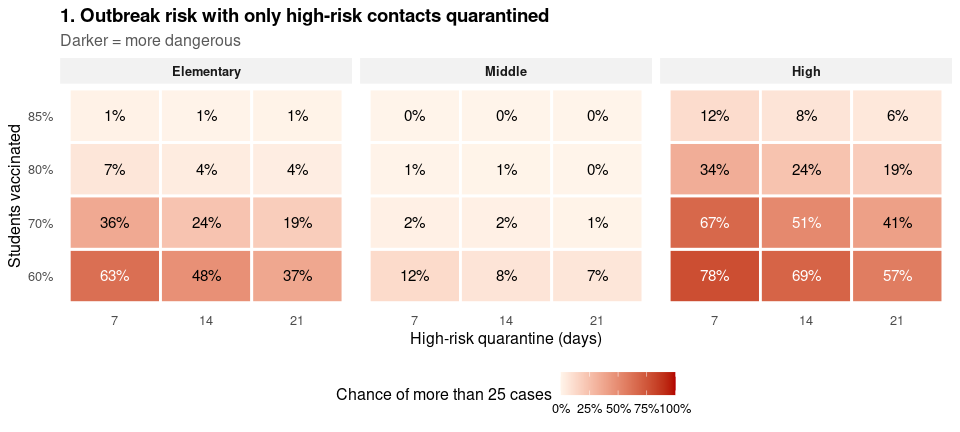
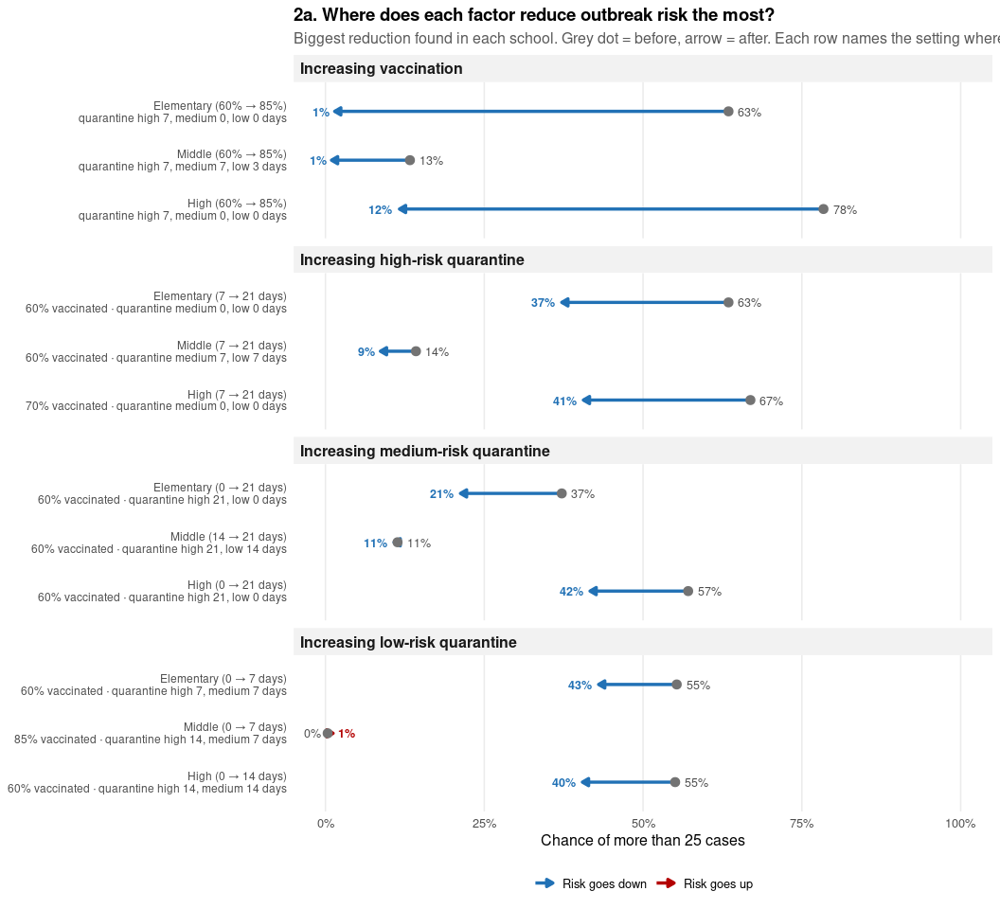
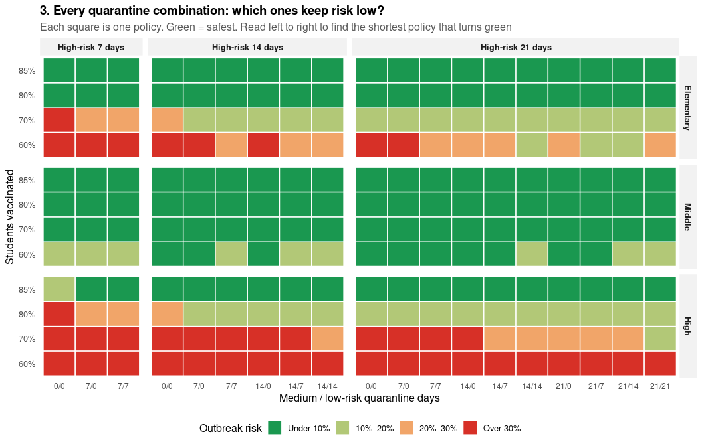
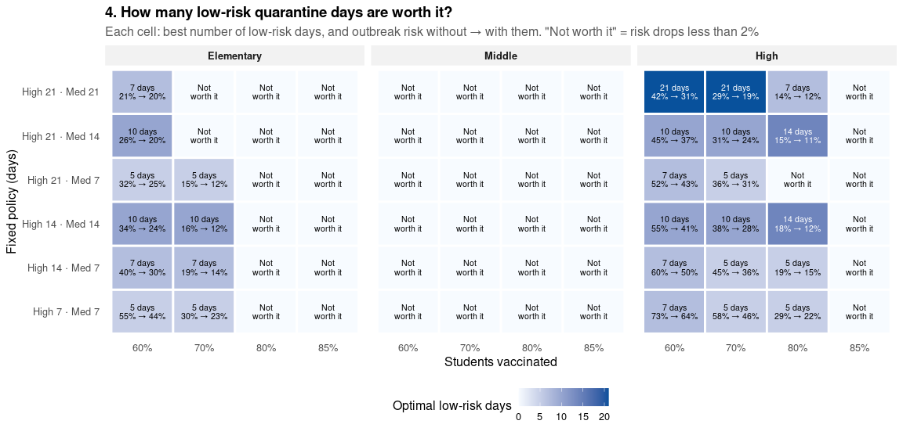
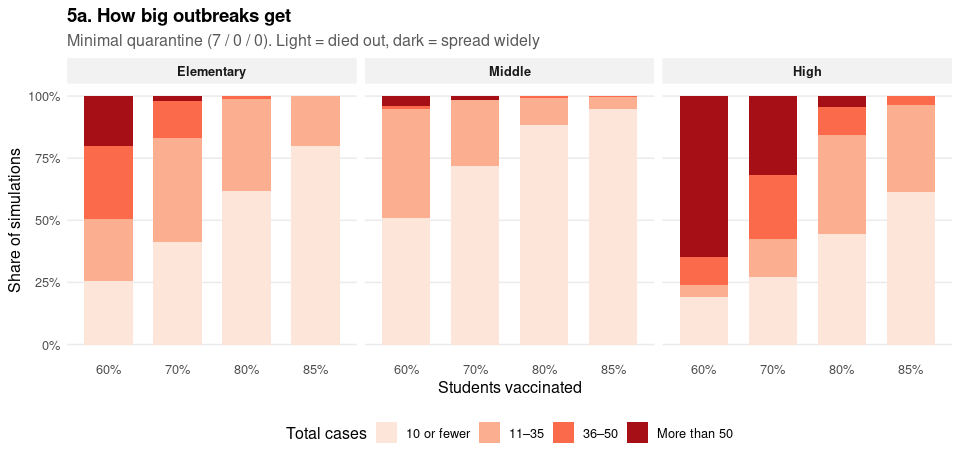
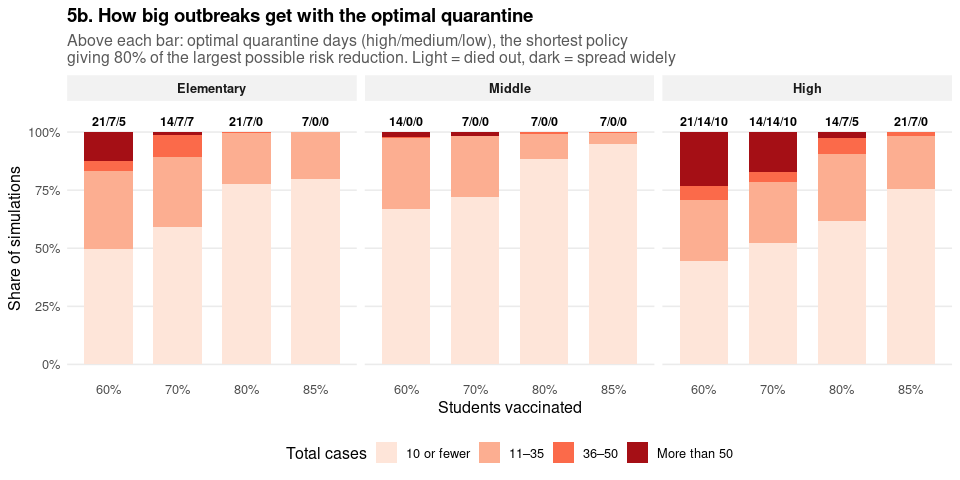
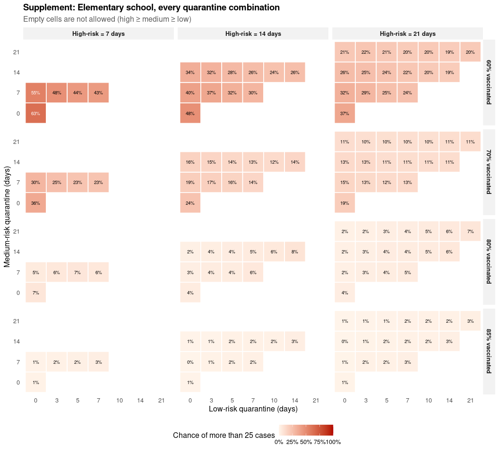
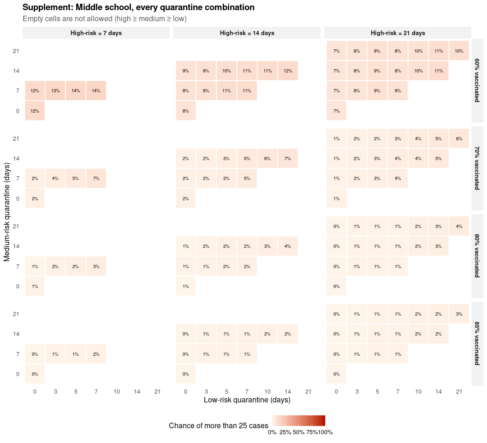
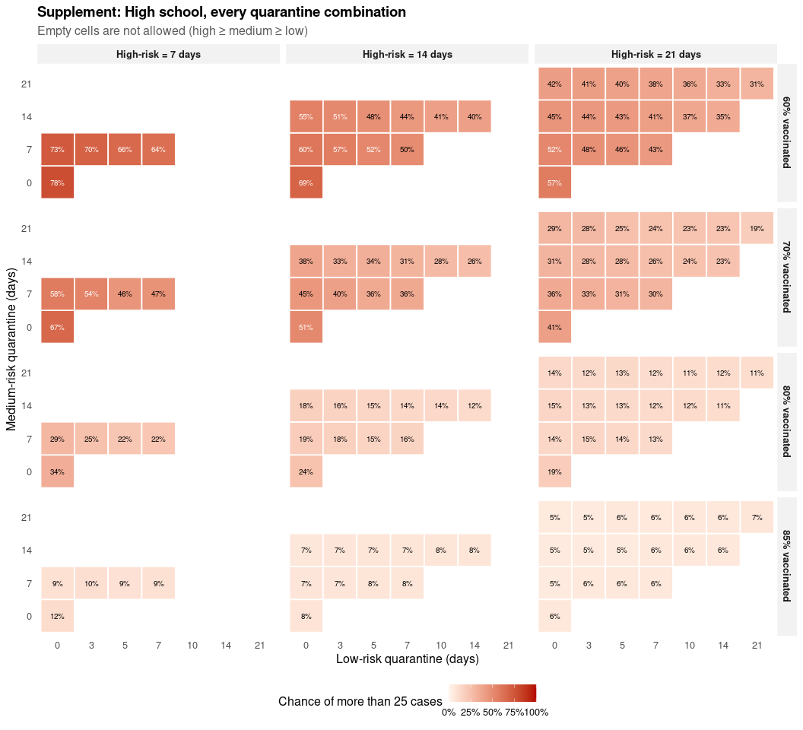

# 3. Which quarantine policy keeps outbreaks small?

- [Simulations](#simulations)
- [1. The problem](#the-problem)
- [2. What drives outbreak risk?](#what-drives-outbreak-risk)
- [3. Which quarantine combinations keep risk
  low?](#which-quarantine-combinations-keep-risk-low)
- [4. How many low-risk quarantine days are worth
  it?](#how-many-low-risk-quarantine-days-are-worth-it)
- [5. How big do outbreaks get?](#how-big-do-outbreaks-get)
- [6. Risk vs low-risk quarantine days, across
  thresholds](#risk-vs-low-risk-quarantine-days-across-thresholds)
- [Supplement: every quarantine combination, per
  school](#supplement-every-quarantine-combination-per-school)
- [Conclusions](#conclusions)

This is the main analysis. Every combination of school, vaccination
coverage and **high / medium / low-risk quarantine days** (with high e
medium e low) is simulated once, and all figures are computed from that
single set of runs.

| Figure | Question                                                               |
|:-------|:-----------------------------------------------------------------------|
| 1      | How risky is each school with minimal quarantine?                      |
| 2     | Where does each factor reduce outbreak risk the most?                  |
| 3      | Which quarantine combinations keep risk low?                           |
| 4      | Given high- and medium-risk days, how many low-risk days are worth it? |
| 5      | When outbreaks happen, how big do they get?                            |
| 6      | How does risk change with low-risk days, across thresholds?            |

Plain-language conclusions, computed from the results, are at the end
and are also written to `results/conclusions.txt`.

<div>

> **Note**
>
> Model code lives in `measles_model.R`. Simulations are cached in
> `results/`, and PNG copies of every figure are saved to `figures/`.

</div>

## Simulations

136 quarantine/vaccination settings per school × 3 schools × 2,000
simulations = 816,000 runs.

<div>

> **What “outbreak risk” means in this report**
>
> Each simulation starts with one infected student. An **outbreak** is a
> simulation that ends with **more than 25 total cases**. The **outbreak
> risk** of a setting is the share of its 2,000 simulations that ended
> this way, i.e. P(final outbreak size \> 25). Figures 1 to 5 and the
> conclusions use this definition; Figure 6 repeats it for several other
> thresholds.

</div>

## 1. The problem

With minimal quarantine (only high-risk contacts quarantined), how
likely is an outbreak?



## 2. What drives outbreak risk?

### Effect of each factor

For every setting, move **one** factor from its lowest to its highest
allowed value while everything else stays fixed. For each factor and
school we show the biggest reduction, and name the setting where it
happens.




## 3. Which quarantine combinations keep risk low?

Every quarantine combination, sorted into risk bands. Columns are medium
/ low-risk days, grouped by high-risk days. Low-risk days are shown in
weekly steps to keep the figure readable.



## 4. How many low-risk quarantine days are worth it?

For each fixed high/medium policy: the fewest low-risk days that give
80% of the benefit low-risk quarantine can provide. Each cell shows
those days and the risk without ’ with them.



## 5. How big do outbreaks get?

<div class="panel-tabset">

### 5a. Minimal quarantine



### 5b. Optimal quarantine

For each school and vaccination level, the optimal policy is the one
with the fewest total quarantine days that gets at least 80% of the
largest possible risk reduction (any high / medium / low combination).
If extra quarantine can’t lower risk by 2%, the minimal policy is kept.



</div>


## Supplement: every quarantine combination, per school

<div class="panel-tabset">

### Elementary



### Middle



### High



</div>

## Conclusions

``` text
CONCLUSIONS  (outbreak = more than 25 cases)

1. THE PROBLEM
   With minimal quarantine, High school is the riskiest (average 48%)
   and Middle school the least risky (average 4%).

2. WHAT MATTERS MOST
   Increasing vaccination, biggest reduction:
     Elementary: risk 63% -> 1%  (60% -> 85%: quarantine high 7, medium 0, low 0 days)
     Middle: risk 13% -> 1%  (60% -> 85%: quarantine high 7, medium 7, low 3 days)
     High: risk 78% -> 12%  (60% -> 85%: quarantine high 7, medium 0, low 0 days)
   Increasing high-risk quarantine, biggest reduction:
     Elementary: risk 63% -> 37%  (7 -> 21 days: 60% vaccinated - quarantine medium 0, low 0 days)
     Middle: risk 14% -> 9%  (7 -> 21 days: 60% vaccinated - quarantine medium 7, low 7 days)
     High: risk 67% -> 41%  (7 -> 21 days: 70% vaccinated - quarantine medium 0, low 0 days)
   Increasing medium-risk quarantine, biggest reduction:
     Elementary: risk 37% -> 21%  (0 -> 21 days: 60% vaccinated - quarantine high 21, low 0 days)
     Middle: risk 11% -> 11%  (14 -> 21 days: 60% vaccinated - quarantine high 21, low 14 days)
     High: risk 57% -> 42%  (0 -> 21 days: 60% vaccinated - quarantine high 21, low 0 days)
   Increasing low-risk quarantine, biggest reduction:
     Elementary: risk 55% -> 43%  (0 -> 7 days: 60% vaccinated - quarantine high 7, medium 7 days)
     Middle: risk 0% -> 1%  (0 -> 7 days: 85% vaccinated - quarantine high 14, medium 7 days)
     High: risk 55% -> 40%  (0 -> 14 days: 60% vaccinated - quarantine high 14, medium 14 days)
   Most dangerous combination: High + 60%–70% vaccinated + high-risk quarantine 7 days -> average risk 62%.
   Safest combination: Elementary or Middle + 80%–85% vaccinated -> average risk 2%.

3. WHAT A SCHOOL SHOULD DO
   To keep risk under 10%:
     Elementary: achievable from 70% vaccination; minimal quarantine is enough from 80% vaccination.
     Middle: achievable from 60% vaccination; minimal quarantine is enough from 70% vaccination.
     High: achievable from 85% vaccination; minimal quarantine is enough at no tested level.
   To keep risk under 20%:
     Elementary: achievable from 60% vaccination; minimal quarantine is enough from 80% vaccination.
     Middle: achievable from 60% vaccination; minimal quarantine is enough from 60% vaccination.
     High: achievable from 70% vaccination; minimal quarantine is enough from 85% vaccination.
   To keep risk under 30%:
     Elementary: achievable from 60% vaccination; minimal quarantine is enough from 80% vaccination.
     Middle: achievable from 60% vaccination; minimal quarantine is enough from 60% vaccination.
     High: achievable from 70% vaccination; minimal quarantine is enough from 85% vaccination.

4. LOW-RISK QUARANTINE
   Elementary: the best low-risk quarantine is usually about 0 days.
     It is not worth it (risk drops less than 2%) in 58% of high/medium settings.
     On average, risk goes 14% -> 11% with the best number of days,
     and only to 11% even with the longest low-risk quarantine.
   Middle: the best low-risk quarantine is usually about 0 days.
     It is not worth it (risk drops less than 2%) in 100% of high/medium settings.
     On average, risk goes 3% -> 3% with the best number of days,
     and only to 3% even with the longest low-risk quarantine.
   High: the best low-risk quarantine is usually about 6 days.
     It is not worth it (risk drops less than 2%) in 29% of high/medium settings.
     On average, risk goes 30% -> 24% with the best number of days,
     and only to 24% even with the longest low-risk quarantine.

5. SIZE OF OUTBREAKS
   Elementary, minimal quarantine: chance of more than 50 cases falls from 20% at 60% to 0% at 85% vaccination.
     Optimal quarantine (high/medium/low days): 21/7/5 at 60%; 14/7/7 at 70%; 21/7/0 at 80%; 7/0/0 at 85%.
     With it, the chance of more than 50 cases is 12% at 60% and 0% at 85% vaccination.
   Middle, minimal quarantine: chance of more than 50 cases falls from 4% at 60% to 0% at 85% vaccination.
     Optimal quarantine (high/medium/low days): 14/0/0 at 60%; 7/0/0 at 70%; 7/0/0 at 80%; 7/0/0 at 85%.
     With it, the chance of more than 50 cases is 2% at 60% and 0% at 85% vaccination.
   High, minimal quarantine: chance of more than 50 cases falls from 65% at 60% to 0% at 85% vaccination.
     Optimal quarantine (high/medium/low days): 21/14/10 at 60%; 14/14/10 at 70%; 14/7/5 at 80%; 21/7/0 at 85%.
     With it, the chance of more than 50 cases is 23% at 60% and 0% at 85% vaccination.
```
